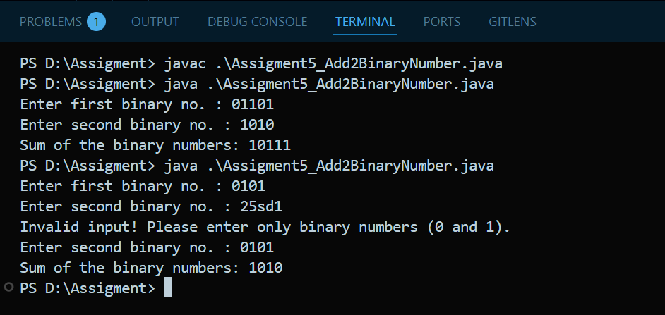
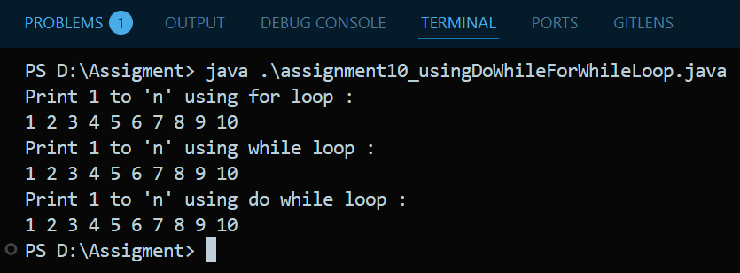

# MCA-206-Java-and-OOPS-lab_PRACTICALS

1. Write a Java program to determine maximum from given 100 numbers.
   
2. Write a Java program to calculate the factorial of a given numbers.
   
3. Java program to check whether a given character is alphabet or not.
   
4. Java program to find sum of all digits.
   
5. Write a Java program to add two binary numbers.
   
6. Write a Java program for switch statement.
   
7. Write a Java program to print perfect numbers
   
8. Write a Java program to convert a decimal number to binary number.
   
9. Write a Java program for Parameterized Constructor.
   
10. Write a Java program using while loop, do while loop, “for” loop.
    
11. Write a Java program to check whether number is Armstrong or not.
    
12. Write a Java program for Hierarchical Inheritance.
13. Write a Java program for abstract class and for interface.
14. Write a Java program to declare, initialize and display the contents of an array of 5
    integer values. Also show in Java how the length of array can be found.
15. Write a program to accept a string and count total capital and small letters in string.
16. Write a Java program to print following output:
    0,1,1,2,3…..(20 such items)
17. Write a Java program for method overloading and for method overriding.
18. Write a Java program to design a class Student that has three data member name ; Roll
    no; Marks in five subject and member function to assign streams on the basis of table
    given below
